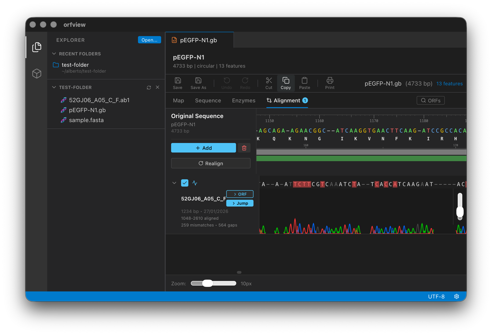

# ORFView

[](LICENSE)
[](https://github.com/florez-alberto/orfview/actions/workflows/test.yml)

[](https://doi.org/10.5281/zenodo.18838850)

**A lightweight desktop app for plasmid visualisation and Sanger sequencing alignment. ~5 MB, no subscriptions, no data collection.**

I built ORFView because I was tired of commercial software that collects user data and locks research behind subscriptions. With Tauri and React, it's possible to build something open, modular, and truly lightweight. Research money is too precious to spend on software-as-a-subscription.



---

## Features

- **Plasmid visualisation** — circular and linear maps via [seqviz](https://github.com/seqviz/seqviz)
- **Chromatogram alignment** — drag & drop AB1 files onto a reference; mismatches highlighted in red
- **Restriction site analysis** and **ORF finder**
- **File browser** — VSCode-style sidebar for navigating project folders
- **Extension system** — customise themes and behavior via `window.orfview` API
- **Cross-platform** — macOS, Linux (Flatpak), and Windows. ~5 MB binary

## Supported Formats

| Format | Extensions | Description |
|--------|------------|-------------|
| GenBank | `.gb`, `.gbk`, `.genbank` | Annotated sequences with features |
| FASTA | `.fasta`, `.fa` | Plain sequence(s) |
| AB1/ABI | `.ab1`, `.abi` | Sanger sequencing chromatograms |

---

## Installation

Download the standalone binary from the [Releases](https://github.com/florez-alberto/orfview/releases) page — no installation required.

## Quick Start

1. **Open a sequence** — drag & drop a `.gb` or `.fasta` file into the window
2. **Align chromatograms** — open a reference plasmid, then drag `.ab1` files onto the drop zone
3. **Analyse** — use the toolbar to find ORFs or restriction sites

---

## Development

### Prerequisites

- [Node.js](https://nodejs.org/) v18+
- [Rust](https://rustup.rs/) (stable toolchain)
- [Tauri v2 prerequisites](https://tauri.app/start/prerequisites/)

### Build & Run

```bash
git clone https://github.com/florez-alberto/orfview.git
cd orfview
npm install
npm run tauri dev     # development (hot-reload)
npm run tauri build   # production binary
npm test              # run tests
```

See [CONTRIBUTING.md](CONTRIBUTING.md) for architecture details, the extension API reference, and guidelines for adding parsers or features.

### Community & Support
- Bug reports — [GitHub Issues](https://github.com/florez-alberto/orfview/issues)
- Feature requests — [start a Discussion](https://github.com/florez-alberto/orfview/discussions)
- Contributing — PRs welcome. See [CONTRIBUTING.md](CONTRIBUTING.md)

### License
[MIT](LICENSE)  — Alberto Florez, 2026